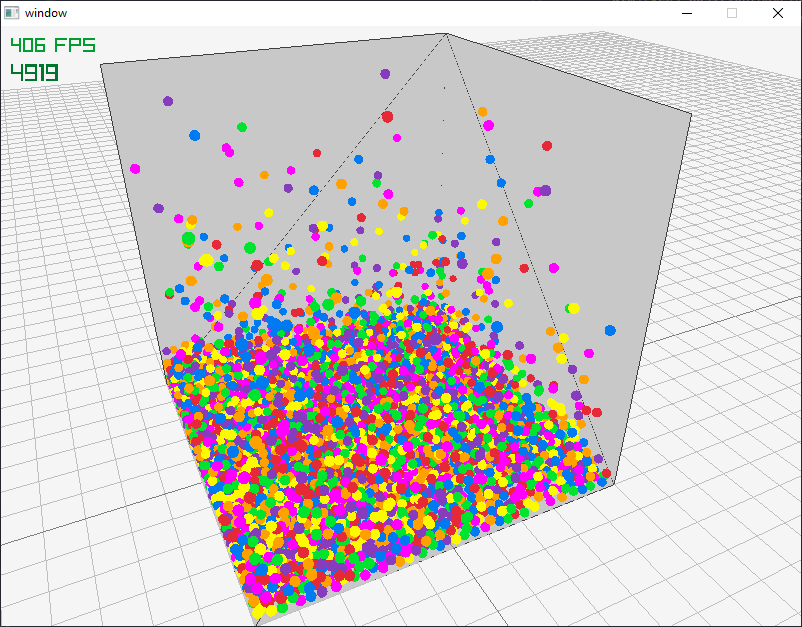

# Particle Simulation



This is a particle simulation built in C++ using Raylib for a university assignment. We were required to implement the simulation on the CPU and on the GPU to be able to compare the performance gain.

I structured the data into a SoA layout to reduce cache misses and used instanced rendering to reduce rendering overhead. For the GPU implementation I used compute shaders. Each step runs as a separate pass, this applies for both simulation types. The results are fed into the instance renderer, either straight from the GPU or uploaded from the CPU. 

Additionally, we were assigned another project that required building an MMO server with physics integration. To cut down on the implementation time, I created DLL based API, which I then used in the [MMO Server](https://github.com/Rocco2300/mmo-server)

## Performance

### 1000 Particles:

| Type | Partitioning | FPS  |
|------|--------------|------|
| CPU  | NO           | 160  |
| CPU  | YES          | 1300 |
| GPU  | NO           | 1700 |
| GPU  | YES          | 40   |

### 4913 Particles:

| Type | Partitioning | FPS  |
|------|--------------|------|
| CPU  | NO           | 7    |
| CPU  | YES          | 120  |
| GPU  | NO           | 410  |
| GPU  | YES          | 1400 |

These results are approximate estimations of the observed average, as such they are in no way a good benchmark. I have measured and added them for the purpose of the assignment. 

The results do still show some interesting facts about the program. The GPU simulation seems to run slower with 1000 particles than with 4913 particles. The cause of this might be the overhead of the grid partitioning code, or a issue with its implementation. While "benchmarking" I have also noticed a bug on the GPU partitioned simulation, this could be the cause of the discrepancy, but I haven't tested it... 


## Requirements

- CMake 3.20 or higher
- MinGW 15.2.0 or equialent

## Dependencies

- Raylib
- GLM

The dependencies are downloaded by CMake (FetchContent)

## Building

```
git clone github.com/Rocco2300/particle-simulation

cd particle-simulation
mkdir build && cd build
cmake .. -G "MinGW Makefiles" -DCMAKE_BUILD_TYPE=Release
cmake --build .

```


## Running 

You can now run the project with the following command:
```
./particle-simulation.exe <mode [--cpu|--gpu]> <--partition> <particleNo>
```

These are the controls:

- Z - to lock/unlock camera
- C - add an impulse to all the particles
- X - add particles

Where you can replace mode with:
- `--gpu` to simulate the world on the GPU
- `--cpu` to simulate the world on the CPU